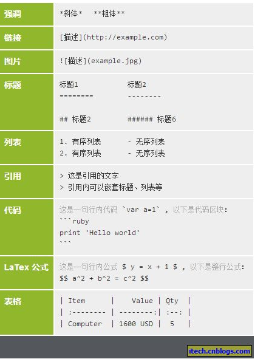

# swagger2常用注解说明
## 1. 版本
*** 
**版本 springfox-swagger 2.8.0**   **springfox-swagger-ui 2.8.0**
*** 

## 2. 常用注解
### 2.1 @Api()
#### 2.1.1 使用范围
用于类；表示标识这个类是swagger的资源
#### 2.1.2 常用参数
tags–表示说明 
value–也是说明，可以使用tags替代
#### 2.1.2 示例
- 添加value

代码:

```java
@Api(value="用户controller")
@RestController
public class UserController {
}
```
效果图:




- 添加tag

```java
@Api(tags={"用户操作接口1"})
@RestController
public class UserController {
}
```

- 添加tags

```java
@Api(tags={"用户操作接口1","用户操作接口2"})
@RestController
public class UserController {
}
```


### 2.2 @ApiOperation()

### 2.3 @ApiParam()
### 2.4 @ApiModel()
### 2.5 @ApiModelProperty()
### 2.6 @ApiIgnore()
### 2.7 @ApiImplicitParam()
### 2.8 @ApiImplicitParams()