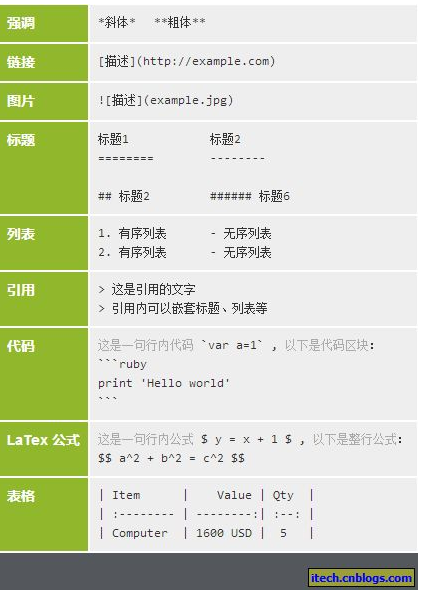

# 开发环境搭建说明
## 1. 如何获取源码及其如何编译
### 1.1 下载源码
请先向研发管理部申请git仓库账号 <a href="mailto:yulu@1218.com.cn?cc=yaohao@1218.com.cn&subject=代码权限申请&body=申请开通dago代码库读写权限(http://172.31.28.170:10080)">戳这里</A>

### 2.2 @ApiOperation()
